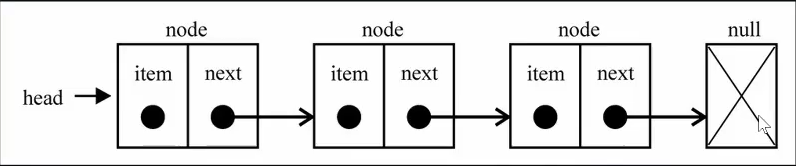

# 链表

链表和数组一样，可以用于**存储一系列的元素**，但是链表和数组的实现机制完全不同

### 数组的缺点

- 数组的创建通常需要申请一段**连续的内存空间**(一整块内存)，并且大小是固定的(JavaScript 数组的大小看似不固定，但是大多数编程语言的数组的大小都是固定的)，所以当当前数组**不能满足容量需求**时，需要**扩容**(一般情况下的做法，是申请一个更大的数组，比如 2 倍，然后就原数组中的元素复制过去)
- 在数组开头或中间插入数据的成本很高，需要进行大量元素的位移
- 尽管 JavaScript 的内置对象 Array 已经可以很方便的完成许多功能如插入删除等，但其背后的原理依然如此

---

### 链表

- 要存储多个元素，另外一个选择就是链表
- 不同于数组，链表中的元素在内存中**不必是连续的空间**
- 链表中的每一个元素由**一个存储元素本身的节点**和**一个指向下一个元素的引用**(有些语言称为指针或者连接)组成
  

---

### 链表相对于数组的优点

- 内存空间不是必须连续的。可以充分利用计算机的内存，实现灵活的**内存动态管理**
- 链表不必在创建时就确定大小，并且大小可以无限的延伸下去
- 链表在**插入和删除**数据时，**时间复杂度**可以达到**O(1)**，相对于数组效率更高

### 链表相对于数组的缺点

- 链表访问任何一个位置的元素时，都需要**从头开始访问**（无法跳过第一个元素访问任何一个元素）
- 无法通过下标直接访问元素，需要从头一个一个访问，直到找到对应的元素

---
